UQP MCMC
========

The UQP MCMC component allows a user to analyse the results coupled experiments and simulations.
A user should already have observed values from an experiment with error bounds and surrogate models mapping
unobserved inputs to the observed quantities of interest. The results of the analysis will be a set of points drawn
as if from the distribution of unobserved inputs that would most likely produce the observed outputs (with error bounds.)

How to set up a problem
-----------------------

Setting up a problem requires instantiating the MCMC object, and adding the input and output variables.
In this example we'll look at a model with 2 inputs and 1 output. Our observed output will have the value :math:`1.2` with
error bounds :math:`\pm 0.1`.

First instantiate the MCMC object. We'll use the :code:`DefaultMCMC` object, which doesn't require any other packages to
be installed.

.. code:: python

   experiment_1 = DefaultMCMC()

Next, we add the input variables. We'll use the names :code:`X` and :code:`Y` for the two input variables.
Each input variable requires a name, a lower bound, an upper bound, and the sigma value for the proposal distribution.
An optional final argument (:code:`prior`) is a function which is the pdf of a prior distribution defined in log space.
If a prior is not given, then a uniform prior is used.
These priors are assumed to be independent.
The upper and lower bound restrict the area of exploration to within the bounds.
The sigma value (:code:`proposal_sigma`)affects how large the proposal jumps are for that variable.

.. code:: python

   experiment_1.add_input('X', -2, 2, .06)
   experiment_1.add_input('Y', -2, 2, .07)

Finally we add the output variables. We'll use the name :code:`Z` for our single output variable.
Each output variable requires the name of the event it is associated with, the name of the quantity represented,
a surrogate model, an observed value, an error value which is represented as a percentage of the observed value, and a
list of input variable names.
The surrogate model must be an object with the :code:`predict()` method implemented in the sklearn fashion.
The list of input variable names indicates which input variables to use for the model's inputs. Each input variable can
be used as an input to any number of output variables.

.. code:: python

   experiment_1.add_output('Z', 'output', surrogate_model, 1.2, .1, ['X', 'Y'])

How to run a chain, get diagnostics, and get points
---------------------------------------------------

Running, getting diagnostics from, and getting points from a chain simply requires calling the :code:`run_chain()`,
:code:`get_diagnostics()`, and :code:`get_chains()` methods.

In order to run a chain the number of points, the number of burn-in iterations, and the thinning rate must be given.
These three parameters are known as :code:`total`, :code:`burn`, and :code:`every` respectively.
The number of points determines how many points to save and return. The number of burn-in iterations determines how
long to run the iterations without saving points. The thinning rate determines at what rate to skip iterations when
saving points. Optionally, a starting value, a random seed, and the number of chains can be provided.
If the number of chains is greater that 1, then the multiple chains will be sampled in parallel.

The number of iterations is given by this formula: :math:`N = (burn + total * every)*n_chains`

.. code:: python

   experiment_1.run_chain(100, 1000, 10)

The diagnostics can be retrieved through the :code:`get_diagnostics()` method.
This method will return a dictionary whose keys are input variable names and values are dictionaries of diagnostics.
The acceptance rate is also in this top level dictionary.
The dictionary of diagnostics contains 6 keys: :code:`r_hat`, :code:`n_eff`, :code:`var_hat`,
:code:`autocorrelation`, :code:`mean`, and :code:`std`.
All of these will have numbers as there values except :code:`autocorrelation`. Its value will be a dictionary mapping lag
numbers to the autocorrelation value at that lag.
An optional argument determines how many sub-chains to split the chain into. This value must evenly divide the number
of points.

.. code:: python

   diagnostics = experiment_1.get_diagnostics()

The points can be retrieved through the :code:`get_chains()` method.
This method will return a dictionary whose keys are input variable names and values are lists.
Each element of the list is a numpy of values. Different elements represent different concurrent runs of the chain.

.. code:: python

   chains = experiment_1.get_chains()

How to tune MCMC
----------------

Tuning an MCMC chain requires adjusting the setup and running of the chain so that the chain converges to the target
distribution properly.
Ideally, the chain would perfectly replicate independent draws from the target distribution. (TODO: Link to MCMC theory for more details)
In reality, while the chain is guaranteed to converge to the target *eventually*, it may be that the configuration of
tuning parameters does not allow the chain to converge fast enough or appear independent.

The diagnostics provide a way to determine how the chain has converged and whether the draws look independent.

* :math:`\hat{R}` or :code:`r_hat` is a diagnostic that determines convergence (whether or not the chain has fully explored the whole distribution.) This value depends on the variance within chains and between chains. If this is too high it means that the chain has not been run long enough to fully converge to the target distribution.

* :math:`N_{eff}` or :code:`n_eff` is a diagnostic that gives an effective sample size of the chains. In other words, it is the sample size of ideal independent draws from the target distribution that would have the same effectiveness. This value depends on the number of points in the chains and the autocorrelation of those points. If this is too low it means that there is high autocorrelation in the chains.

* :math:`lag()` or :code:`autocorrelation` measures how individual points are dependent on recently drawn points. If this is too high it means that successive draws are highly dependent i.e. not independent.

* The acceptance rate measures the ratio between the number of accepted points and the total number of points. If this is too low then the chain will not be accepting enough points indicating that the chain is getting stuck. If this is too high then the chain is not sampling efficiently. It also violates the condition that the samples be independent draws.

The tuning parameters are the proposal distribution standard deviation (proposal sigma), the number of burn in iterations,
the number of iterations to skip, and the total number of points to draw.
Because the MCMC algorithm guarantees eventual convergence, drawing more points almost always improves diagnostics.

Proposal Sigma
~~~~~~~~~~~~~~

As a general rule of thumb, the proposal sigma should be proportional to the target distribution's standard deviation for each variable.
Running a short, un-tuned chain can give an initial estimate of this value through :code:`var_hat`.
Taking the square root of this variance estimate will give a good starting value for the target distribution's standard deviation.

We can get a gauge on how well the chain is sampling by looking at the acceptance rate.
A good value for the acceptance rate should be between :math:`0.15` and :math:`0.40` with a target of :math:`0.25`. Increasing
the proposal sigma generally decreases the acceptance rate and decreasing the proposal sigma generally increases the
acceptance rate.

It is also good to look at a trace plot of the chain. This plots the value sampled against the iteration number.
This can reveal problems in the chains that may not be obvious from just looking at the diagnostics. The following images
show some common problems and ways to solve them.

.. _drw:
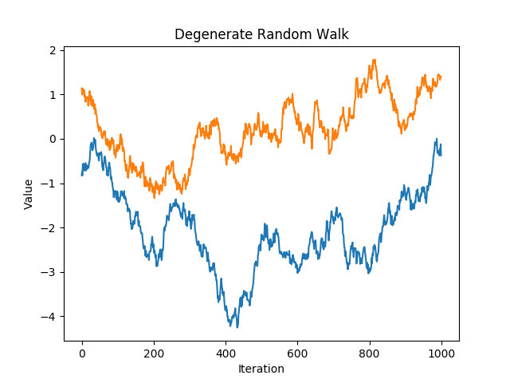

   A chain with a high acceptance rate that has degenerated to a random walk.

:numref:`drw` shows a chain with a high acceptance rate. This is likely due to a low proposal sigma. The metropolis
algorithm is proposing very short jumps thus there is little difference between the current point and the proposal point.
This means that it is unlikely to propose a point far away from an area of high probability density and so the proposed
point is very likely to be accepted. This is a very inefficient way to sample the space. If the distribution is very
wide, then it will take a very high number of iterations to fully move about the entire space. To fix this problem, try
increasing the proposal sigma so that it will propose larger jumps.

.. _mm:
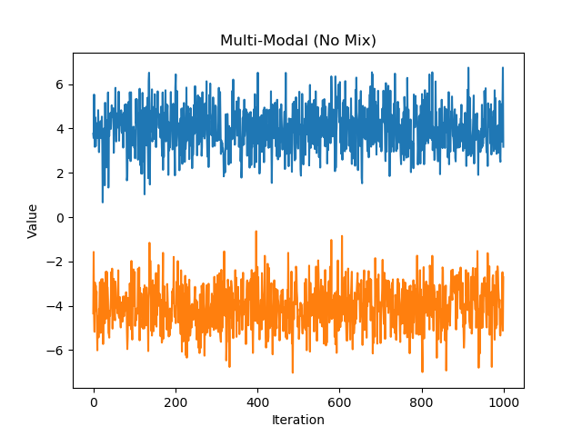

   A bimodal distribution whose chains have not mixed properly

:numref:`mm` shows a chain sampling from a bimodal distribution. Each appears stationary on its own, but in juxtaposition
we can see that the chains are not mixing properly. This is due to an incorrectly chosen proposal sigma. In this case,
we would want the proposal distribution to be able to reach between the two modes. It should have enough variance that it
would be likely to propose a point in the opposite mode. So in this case a good value to choose for the proposal sigma
might be 8 (approximately the distance between the two modes.)

.. _ss:
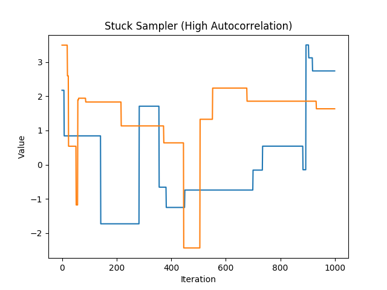

   A chain with a low acceptance rate that gets stuck for many iterations.

:numref:`ss` shows a chain with a low acceptance rate. This is likely due to a high proposal sigma. The metropolis
algorithm is proposing very long jumps far away from the locations of high probability density. This means that
the points are essentially stuck until the metropolis algorithm either proposes something closer or accepts a point
from an area with very low probability density (both of which are very unlikely.) This is a very inefficient way to sample
the space. It will take many iterations to fully explore the space because each point gets stuck for an artificially high
number of iterations. To fix this problem, try decreasing the proposal sigma so that it will propose smaller jumps.

.. _gc:
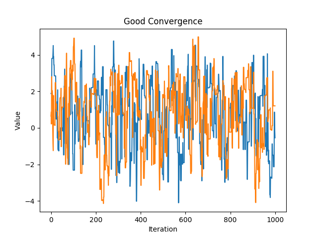

   A chain that shows good mixing and fast convergence

:numref:`gc` show a chain with a properly tuned proposal distribution.

Burn In
~~~~~~~

The ``burn`` parameter is the number of iterations to discard from the beginning.
This is necessary because the starting point is not guaranteed to be near an area of high probability density. If it is not,
then it will take time to move into the area we want to sample from. This will artificially inflate the weight of the
area it had to traverse to get to where we want to sample from. :numref:`nb` shows a chain that did not discard the burn-in
iterations. Notice the tail at the start of the iterations.

.. _nb:
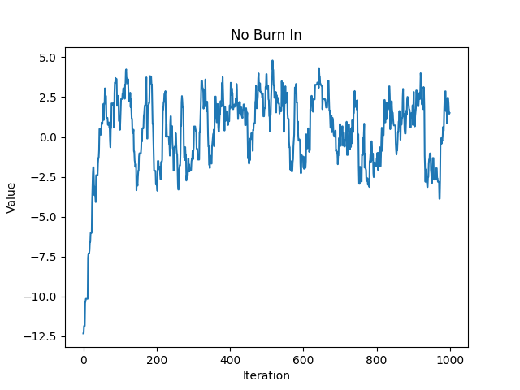

   A chain that did not discard burn-in iterations

Take Every
~~~~~~~~~~

The ``every`` parameter says how many iterations to skip before saving a point to the chain. This is a good way to reduce
autocorrelation. Each iteration of the markov chain directly depends only on the previous iteration. By adding space
between each saved iteration, there is less dependence between the points and therefor less autocorrelation.  Be sure that you
have tuned the other parameters as best you can before you touch this parameter, as it is essentially just increasing
the number of iterations.

Conclusion
~~~~~~~~~~

In practice, it will often take multiple iterations of adjusting tuning parameters and running short chains until
an appropriate set has been found. Once the tuning has been found, sample as many iterations as is practical by increasing
``total`` and ``every``. Setting ``n_chains`` to a number higher than 1 will cause multiple chains to be sampled in parallel,
thus multiplying the number of iterations.
As the number of iterations increase the chains converge closer to the target distribution.

As a rule of thumb:

* ``r_hat`` should be less than :math:`1.1`

* ``n_eff`` should be greater than :math:`10,000`

* ``autocorrelation`` should be as close to :math:`0` as possible for all lag values.

For a more in depth discussion on tuning MCMC chains see
`Gelman & Shirley <http://www.mcmchandbook.net/HandbookChapter6.pdf>`_.

Model Discrepancy
-----------------

Model Discrepancy refers to a systemic difference between the model output and reality. This systemic difference can be
captured through an extension of our default MCMC setup. The discrepancy is modeled as an additional covariance that is
the same across quantities.

For example, consider an experiment where a ball is dropped from a height. The fall time and the impact force are
measured for several initial drop heights. These quantities of interest are modeled using a computer simulation as a
function of the ball's cross sectional area. Using a model discrepancy framework the systemic difference between the
measured value and what is produced by the computer simulation is assumed to be the same across all events of dropping
the ball. There will be a certain variance (tau squared) for the fall time, another variance for the impact force,
as well as a correlation between the two (rho).

To use the Model Discrepancy framework, simply replace :code:`DefaultMCMC()` with :code:`DiscrepancyMCMC()`.
This causes the tau and rho parameters to be sampled along with the input parameters. Because this is a different model,
it will likely require different tuning parameters to achieve convergence.

To change the priors or proposal distances for these new parameters, simply update the corresponding property e.g.

.. code:: python

   mcmc_object.rho_proposal_sigma = .03
   mcmc_object.tau_prior_alpha = 4

What is MCMC?
-------------

MCMC stands for `Markov Chain Monte Carlo <https://en.wikipedia.org/wiki/Markov_chain_Monte_Carlo>`_.
It provides a way to use Bayes' Theorem to efficiently sample from an arbitrary target distribution.
It is especially useful for bayesian analysis because it can sample from distributions that are only specified up to proportionality.
This means that we can skip evaluating integrals in the normalizing constants that Bayes' Theorem produces.

A more in depth discussion of MCMC by Francisco Beltran can be found :download:`here <_static/Beltran_Intro_MCMC.pdf>`.
Kevin Driver has made a set of slides that explain MCMC and his exploration of the Hill Function which can be found :download:`here <_static/UQP_components_tutorial_HillFunction.pptx>`

How does MCMC work?
-------------------

Markov Chain Monte Carlo works by setting up a `markov chain <https://en.wikipedia.org/wiki/Markov_chain>`_ that has the target
distribution as its `equilibrium distribution <https://en.wikipedia.org/wiki/Markov_chain#Steady-state_analysis_and_limiting_distributions>`_.

This can be done using a number of different algorithms:

* `Metropolis-Hastings <https://en.wikipedia.org/wiki/Metropolis%E2%80%93Hastings_algorithm>`_
* `Gibbs Sampling <https://en.wikipedia.org/wiki/Gibbs_sampling>`_
* `Hamiltonian (or Hybrid) Monte Carlo <https://en.wikipedia.org/wiki/Hamiltonian_Monte_Carlo>`_ (HMC)

The basic premise of these algorithms is in each iteration a new point is proposed by some proposal function.
This new point is conditioned on the current point.
For instance in the Metropolis-Hastings algorithm a normal distribution with a mean of the current point is often used for the proposal distribution.

This new point is accepted or rejected based on a comparison of the probability density at the two points.
A proposed point in a higher density area will always be accepted.
A proposed point in a lower density area may or may not be accepted.
Its likelihood of being accepted is based on the ratio of the densities of the two points.

Because each new point is only conditioned the previous point, the sequence of points forms a markov chain.
It can be proven that the stationary distribution of this markov chain will exactly be the target distribution.
Note that a markov chain is guaranteed to converge to its stationary distribution eventually.
This can happen very quickly or very slowly, depending on how the chain is tuned.

An Overview of Bayesian Statistics
----------------------------------

Thanks to Kevin Driver for these slides

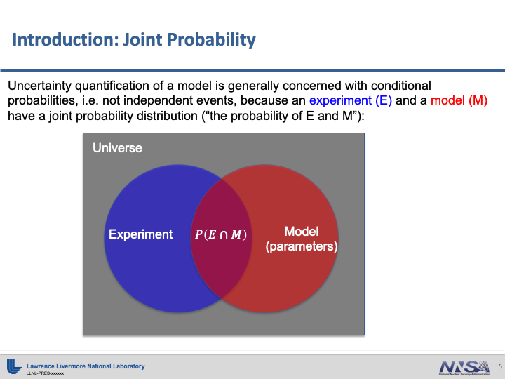

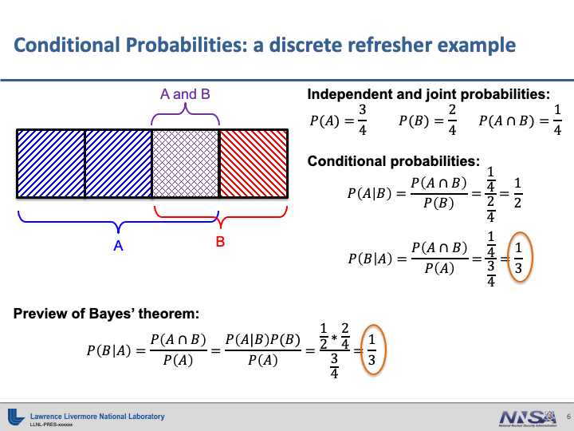

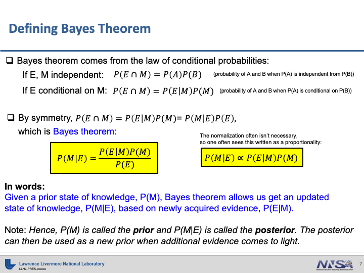

.. figure:: _static/inference.png
   :alt: inference slide

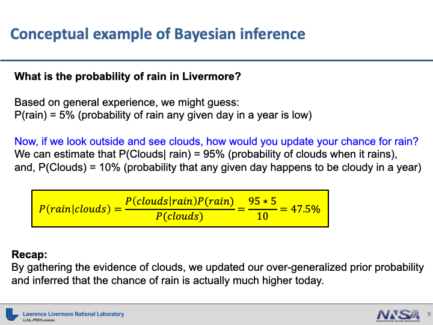

.. figure:: _static/inference_picture.png
   :alt: inference pictures slide

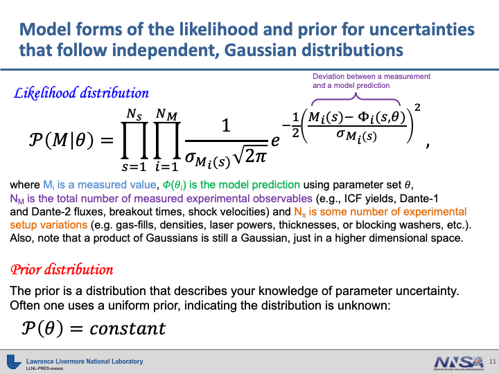

Hill Example
------------

The hill function is an analytic function that allows us to demonstrate how MCMC can work in practice.
An implementation of the Hill Function example can be found here: :ref:`uqp_examples:Hill`.
It is a multivariate function defined as

.. math::

   f(x,a,b,c)=a\frac{x^c}{x^c+b^c}

We have a set of :math:`(x,y)` pairs:

.. list-table::
   :widths: 25 25
   :header-rows: 1

   * - :math:`x`
     - :math:`y`
   * - 1.7995
     - 3.4459
   * - 0.83629
     - 2.7616
   * - 2.3971
     - 3.0697
   * - 2.2857
     - 3.4208
   * - 1.1870
     - 2.9719
   * - 1.9797
     - 3.1330
   * - 1.2773
     - 3.5070
   * - 1.3973
     - 3.0320
   * - 0.64994
     - 1.4260
   * - 1.1062
     - 3.3516
   * - 1.0851
     - 3.4861

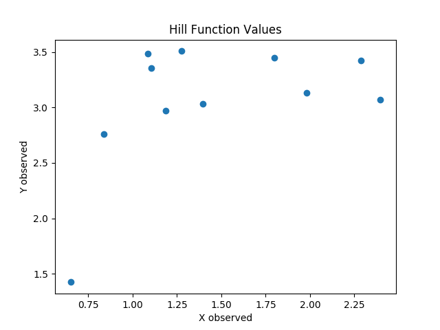

These points represent our known data.
The points were "observed" with random noise.
This means that there is uncertainty about the exact values.

Inverse UQ
~~~~~~~~~~

We want to determine the values of :math:`a`, :math:`b`, and :math:`c` which produce our known data.
However, because our observed data has uncertainty associated with it, our determinations of these values will also have uncertainty.
The goal of IUQ or **Inverse Uncertainty Quantification** is to estimate unknown values which produce observed values.
In other words, we want to find the most likely values for :math:`a`, :math:`b`, and :math:`c` which could produce our observed :math:`(x,y)` pairs.

Surrogate Models
~~~~~~~~~~~~~~~~

Using MCMC to do IUQ requires evaluating our function many times.
For most problems of interest, the function we wish to evaluate is computationally expensive.
To speed up our computation, we use a machine learning model, which is much faster to evaluate, in place of our function.
This model is referred to as the **Surrogate Model**.
We build this surrogate model by sampling our parameter space (:math:`a`, :math:`b`, and :math:`c`) and evaluating the function at those points.
Then we train the surrogate model on these points.
Because we have several observations we want to match, we will create several surrogate models; one for each observed :math:`(x,y)` pair.

MCMC
~~~~

Once we have our surrogate models we can perform **Markov Chain Monte Carlo**.
The purpose of MCMC is to sample from a distribution using a likelihood function.
Our likelihood function is :math:`\prod p(f_i(a,b,c), \mu=Y_i, \sigma^2)` where :math:`p` is the Gaussian pdf and :math:`f_i` is the i-th surrogate model.
This lets us sample from the joint distribution of :math:`a`, :math:`b`, and :math:`c`.

At the end of sampling we should see the mean of our distribution be :math:`(a=3.238, b=0.6631, c=8.408)`

MCMC IUQ Algorithm Explained to a child
~~~~~~~~~~~~~~~~~~~~~~~~~~~~~~~~~~~~~~~

1. Pick :math:`a`, :math:`b`, and :math:`c` at random and save it.
2. Evaluate all functions at that point.
3. Compare the evaluations to the observed values.
4. Pick a new :math:`a`, :math:`b`, and :math:`c` close to the saved value.
5. Evaluate all functions at that point.
6. Compare the evaluations to the observed values.
7. If the evaluations at the new value are closer than the old evaluations, then save the new :math:`a`, :math:`b`, and :math:`c`.
8. If not, maybe save the new point or maybe save the old :math:`a`, :math:`b`, and :math:`c`.
9. Go back to step 4 and repeat until enough points have been saved.

MCMC IUQ Algorithm Explained to an adult
~~~~~~~~~~~~~~~~~~~~~~~~~~~~~~~~~~~~~~~~

1. Pick a point :math:`X_{previous}` at random in the parameter space :math:`(a,b,c)` and save it.
2. Calculate :math:`Z_i=f_i(X_0)` for all surrogate models :math:`f`.
3. Calculate the likelihood :math:`L_{previous}=\prod p(Z_i, \mu=Y_i, \sigma^2)` where :math:`p` is the Gaussian pdf.

- For n = 1 to N
    4. Pick a new point :math:`X_{current}\sim N(X_{previous}, \sigma_{proposal}^2)`.
    5. Calculate :math:`Z=f(X_{current})` for all surrogate models :math:`f`.
    6. Calculate the likelihood :math:`L_{current}=\prod p(Z, \mu=Y_i, \sigma^2)`
    7. Generate a random number :math:`u` from :math:`[0,1]`.

    - If :math:`L_{current}/L_{previous}>u`
        8. Save :math:`X_{current}` to results array
        9. :math:`L_{previous}` <- :math:`L_{current}`
        10. :math:`X_{previous}` <- :math:`X_{current}`

    - Else
        11. Save :math:`X_{previous}`

Forward UQ
~~~~~~~~~~

Once we have the set of point from running MCMC we can perform **Forward Uncertainty Quantification**.
If we had another process that depended on :math:`a`, :math:`b`, and :math:`c`, we could use our sampled values to perform a prediction with uncertainty.
We can use an ensemble to create a surrogate model (as described above.)
We can then evaluate our new surrogate model at all the points sampled using MCMC.
This will create a set of samples for our prediction.
We can use these samples to estimate the uncertainty about the new predicted value.

Tuning
~~~~~~

Convergence Metrics
```````````````````

Our ultimate goal with tuning is to cause our chains to converge to the target distribution.
We can estimate convergence by looking at the potential scale reduction statistic or Rhat, as well as our trace plots and autocorrelation plots.
A converged chain should look like independent draws from the target distribution.
Rhat measures whether the chain is homogeneous through out the iterations i.e. it is not drifting.
For a fully converged chain we expect this to be close to 1, usually less than 1.01.
The trace plots can expose this drifting as well.
The autocorrelation shows correlation between successive iterations.
For a fully converged chain we should expect this be close to 0.

Ultimately we want to sample as many independent draws as possible from our target distribution.
The measure of how effective our samples are is called "N effective" or Neff.
This is found by taking our total number of draws divided by a sum of the autocorrelations.
Neff says that values with autocorrelations are less effective than fully independent, uncorrelated draws.
In general, we want to see Neff above 10,000.

Proposal Sigma
``````````````

In order to get our chain to converge to the target distribution within a reasonable amount of time, we need to tune our chain.
It is important to make sure that your chain is converging well before you move onto high volume sampling.
The main knobs we use to tune our chain are the proposal distribution's standard deviation.
This is often referred to as the "proposal sigma".
In each proposal step, a new point is drawn from a normal distribution centered at the current point.
The standard deviation of this distribution determines the average distance between these points.

We have to tune this knob because a poor choice for this value can lead to poor convergence.
If it is chosen to be too big the proposal step will often propose points in an area of low probability.
Essentially, it will try to step out of the sweet spot that we want to sample from.
If it is chosen to be too small the proposal step will often propose points too close to the current point.
The sampler will move slowly throughout the space and will have trouble jumping between the modes of multimodal distributions.

The goal in tuning the proposal sigmas is to get our acceptance rate close to 25%.
The acceptance rate is the rate at which proposed points are accepted.
25% is our rule of thumb to shoot for, though any rate between roughly 20% and 30% is generally acceptable.

We must choose good values for the proposal sigma for all of our parameters.
Even if only one value is poorly chosen it can still cause poor convergence for the chain.
Good convergence in one chain does not imply good convergence in the others.

Every
`````

Once we have adjusted the proposal sigmas of each variable the chains may still not show full convergence.
In this case we can start to sample more points.
A naive approach would be to simply sample more points direcly.
However we can achieve the same outcome by simply saving points less often.
This is done by tuning the "every" parameter when sampling.
This parameter says to only save every nth point.
Increasing this parameter causes more iterations to be run, increasing our sample count, while not increasing our memory usage.


Examples of Poor Convergence
~~~~~~~~~~~~~~~~~~~~~~~~~~~~

.. note::
   There is a difference in the parametrization between the work Kevin has done and the example files provided.
   The slides present results with :math:`a`, :math:`b`, and :math:`c` scaled to be between 0 and 2.
   The example files retain the original scale with :math:`a\in(2,10)`, :math:`b\in(0,3)`, and :math:`c\in(1,20)`.

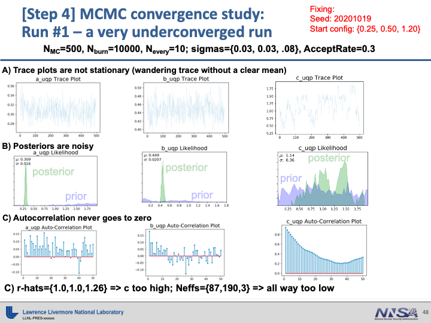

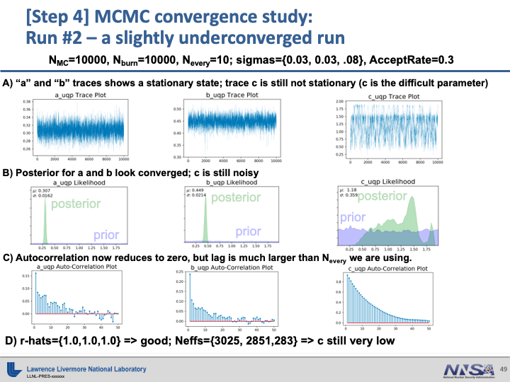

Example of Good Convergence
~~~~~~~~~~~~~~~~~~~~~~~~~~~

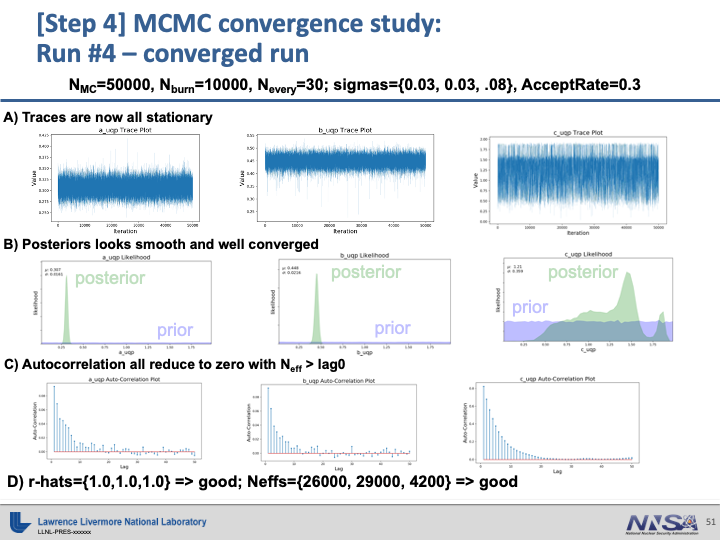

MCMC API
---------------

.. automodule:: uq_methods.uqp_mcmc
   :members: MCMC, DefaultMCMC, DiscrepancyMCMC