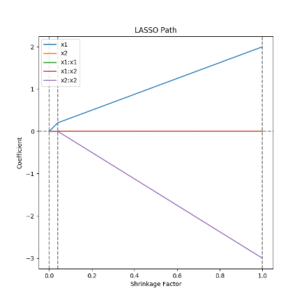
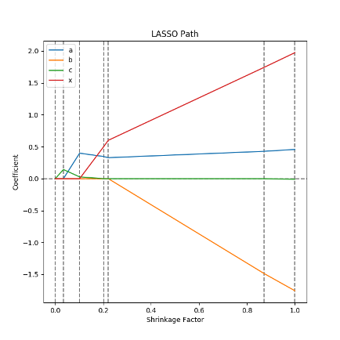

Sensitivity Tutorial
====================

What is Sensitivity Analysis?
-----------------------------

Sensitivity analysis is a broad term that covers several related ideas.
In general, we have some function :math:`f` that we want to model.
This is usually some sort of computer simulation where we vary a set of parameters :math:`X` to produce a set of outputs :math:`Y=f(X)`.
We then ask the questions "How does :math:`Y` change as :math:`X` changes?" and "Which parts of :math:`X` is :math:`Y` sensitive to?"
Often this is done so that we can choose to ignore the parameters of :math:`X` which don't affect :math:`Y` in subsequent analyses.
(Another name for Sensitivity Analysis is Feature Selection.)

How to Perform Sensitivity Analysis
-----------------------------------

Sampling
~~~~~~~~

In order to analyse our function :math:`f` we must first produce our data :math:`X` and :math:`Y`.
This can be accomplished by running an ensemble of our computer simulation with each run using a different value for :math:`X`.
Sampling refers to the process of selecting :math:`X` so that we can explore our parameter space.

We are attempting to strike a balance between two extremes.
On the one hand, each new point gives us more information about :math:`f`, so we want to sample as many points as possible.
On the other hand, each new point adds computation time, so we want to sample as few points as possible.
The key to striking this balance is to understand what questions we are trying to answer.
Some techniques require a large number of samples, while other may only require a few well chosen points.

It is also important to keep in mind that as we add dimensions to :math:`X`, we will be increasing the size of the space we must explore
Consider a parameter space with two dimensions, :math:`\Omega=[-1,1]\times[-1,1]`.
The volume of this space (which is a square) is :math:`2^2=4`.
But if we add another parameter so that :math:`\Omega=[-1,1]\times[-1,1]\times[-1,1]`, the volume of this extended space (now a cube) would be :math:`2^3=8`.
In general, for a space :math:`\Omega=[-1,1]^p` the volume of that space will be :math:`2^p`.
In other words, volume increases exponentially as we add dimensions.
This exponential increase is sometimes referred to as "The Curse of Dimensionality."

The choice of sampling technique will be informed by the choice of model.
Each model expects the data to be structured a certain way, and may even expect a certain sampling technique.
Make sure that the sampling technique used fits with the chosen model.

Modeling
~~~~~~~~

Once we have chosen :math:`X` and run an ensemble to produce :math:`Y=f(X)` we can begin to model :math:`f`.
Choosing a model is the main decision point in sensitivity analysis.
Different modeling choices will determine which techniques we can use, and may affect our final conclusions.
Therefore, it is best to use multiple models and techniques to inform a final conclusion.

A thorough analysis will also consider the assumptions each model uses.
It is important to check that the data conforms to these assumptions, as a model is only valid if its assumptions are met.
Some models are robust to violations in their assumptions.
In these cases, we must still be aware of where our data is in violation, and by how much, as it is still possible to end up with an invalid model if we move too far beyond the limits.

Finally, it is important to keep in mind the quote from George Box:

    All models are wrong, but some are useful.

Though this quote is cliche by now, it is worth remembering that no model will ever be able to fully capture all of the information from :math:`f`.
This is doubly true when :math:`f` itself is a simulation of a physical process.

Inference
~~~~~~~~~

Once we have a model :math:`\tilde{f}` which represents :math:`f`, we can make inferences about the sensitivities of :math:`f`.
Each model will have a unique way to produce inferences.


Techniques
----------

One at a Time and Morris One at a Time
~~~~~~~~~~~~~~~~~~~~~~~~~~~~~~~~~~~~~~

One at a Time studies are based on changing :math:`X` one component at a time.

Say we have two points that only differ in their :math:`j^\text{th}` component.
We can calculate an elementary effect for this pair of points as

.. math::
   \delta_{j,i}=\frac{f(X_i+\Delta\mathbf{e}_j)-f(X_i)}{\Delta}

This elementary effect is an estimate of the :math:`j^\text{th}` component of the gradient of :math:`f`.

If we then say that we have :math:`N` of these pairs of points that only differ in their :math:`j^\text{th}` component, we can calculate a set of :math:`N` elementary effects for the :math:`j^\text{th}` dimension.
The distribution of these effects will approximate the distribution of the :math:`j^\text{th}` component of the gradient of :math:`f`.
So, if that distribution is concentrated around zero, that is a good indication that :math:`f` is not sensitive to the :math:`j^\text{th}` component of :math:`X`.
Looking at the mean and standard deviation of the elementary effects can give a good indication of the distribution, but if :math:`f` is not monotonic, i.e. the gradient of :math:`f` can be positive and negative, some of these effects will cancel out.
Thus, it is a good idea to also look at the modified mean :math:`\mu_j^*=\frac{1}{N}\sum|\delta_{j,i}|`.

The simplest form of One at a Time sampling would be to choose a set of :math:`N` pairs of points where each pair only varies in the :math:`j^\text{th}` dimension.
Then each pair could be used to calculate one elementary effect.
This is an inefficient way of going about this, as it would take a total of :math:`2Np` points to calculate :math:`N` elementary effects for each of the :math:`p` dimensions.
The rate of effects to points is :math:`\frac{Np}{2Np}=\frac{1}{2}`.
It is possible to do better.

Ordinary One at a Time sampling will give :math:`2p+1` points: A central point, and a high and low point for each dimension.
In this case, the central point is reused in every effect calculation.
Only a total of two effects can be calculated in every dimension, and theses effects may be dependent on where the central point is located.
However, the rate of effects to points is now :math:`\frac{2p}{2p+1}`.
This form of OAT sampling is great as a first pass when there are a very high number of dimensions to consider.

Morris One at a Time sampling also takes advantage of using a point more than once when calculating effects.
The sampling is done by starting at a point and varying each dimension one at a time until all of the dimensions have been varied.
This results in a path of :math:`p+1` points where each point varies from the adjacent point in only one dimension.
Thus for each of these paths, :math:`p` effects can be calculated, one for each dimension, and there is less dependence between these effects.
The rate of effects to points is :math:`\frac{p}{p+1}`.
This technique strikes a balance between the efficiency of Ordinary One at a Time sampling and the independence of the naive One at a Time sampling.

Linear Models
~~~~~~~~~~~~~

A `Linear Model <https://en.wikipedia.org/wiki/Linear_regression>`_ assumes that there is only a linear relationship between :math:`X` and :math:`Y` and that any variation away from that linear relationship is caused by random noise.
Then we can write

.. math::
   Y=X\beta+\xi

where :math:`\xi\sim\mathcal{N}(0,\sigma^2)`.

Modeling our data this way leads to a simple interpretation of :math:`\beta`.
For each component of :math:`\beta`, we can say that as the corresponding component in :math:`X` increases by one unit, :math:`Y` increases :math:`\beta` units on average, when all other components of :math:`X` are held constant.
This means that :math:`\beta` is an indicator of sensitivity.
Large absolute values in :math:`\beta` correspond to large sensitivities from :math:`X`.
However, values close to zero in :math:`\beta` do not necessarily correspond to a lack of sensitivity from :math:`X`.

Whether the values of :math:`\beta` are near to or far from zero depends on the units of :math:`X` and :math:`Y`.
Consider a model where :math:`X` is measured in grams and :math:`Y` is measured in meters.
Then :math:`\beta` must have units of meters per gram.
If we then convert :math:`X` and :math:`Y` so that they are now measured in kilograms and centimeters, then the units of :math:`\beta` would then be centimeters per kilogram.
This unit :math:`100,000` times smaller than meters per gram, so the values of :math:`\beta` must then be :math:`100,000` times larger.
Different implementations of this model can provide tools for dealing with this issue.

This model has several assumptions built into it.
 * Linearity - There is solely a linear relationship between :math:`X` and :math:`Y`.
   If this model is applied to data with non-linear interactions, those interactions will be absorbed in to the error term :math:`\xi`.
 * Independence - The errors :math:`\xi` are independent of each other.
   Some data may exhibit spatial or temporal correlations.
   If this correlation is not accounted for, it will lead to an incorrect estimation of the errors.
 * Normality - The errors :math:`\xi` have a normal distribution.
   Thanks to the `Central Limit Theorem <https://en.wikipedia.org/wiki/Central_limit_theorem>`_, the errors approach a normal distribution as the number of samples increases even if :math:`\xi` is not normal as such.
   (Generalized Linear Models relax this assumption.)
 * Homoscedasticity (Constant Variance) - The variance of :math:`\xi` should be constant for all values of :math:`X`.
 * Lack of Multicollinearity - The columns of :math:`X` must not be linear combinations of any other columns in :math:`X`.
   In other words, :math:`X` must have full column rank.

Verifying that these assumptions are met is a key part of fitting a linear model.

Ordinary Least Squares (OLS)
````````````````````````````
`Ordinary Least Squares <https://en.wikipedia.org/wiki/Ordinary_least_squares>`_ seeks to find an estimate for :math:`\beta` that minimizes squared errors.
We call this estimate :math:`\hat{\beta}`.
Then we can say

.. math::
   \hat{\beta}=\underset{\beta}{\arg\min}\|Y-X\beta\|^2

The closed form solution for :math:`\hat{\beta}` and :math:`\hat{\xi}` is

.. math::
   \hat{\beta}=\left(X^\top X\right)^{-1}X^\top Y

.. math::
   \hat{\xi}=Y-\hat{\beta}X

The unbiased estimate of :math:`\sigma^2` is

.. math::
   s^2=\frac{\hat{\xi}^\top\hat{\xi}}{n-p}

where :math:`n` is the number of samples and :math:`p` is the number of dimensions.

If all assumptions are met, then under a null hypothesis that :math:`\beta_j=0`,

.. math::
   t_j=\frac{\hat{\beta}_j}{\sqrt{s^2\left(X^\top X\right)_{jj}^{-1}}}

will have a Students-t distribution with :math:`n-p` degrees of freedom.
If :math:`t_j` is far from zero it means that we would reject the null hypothesis that :math:`\beta_j=0`.
This hypothesis test is a way to quantify what it means for :math:`\hat{\beta}` to be near to or far from zero.

F-Scores
````````

We can use an :math:`F`-test to compare subsets of our model.
Consider a linear model where we exclude one of the features by setting :math:`\hat{\beta}_i=0`.
Call this new model the reduced model and our original model the unreduced model.
The then our residuals from the reduced model are :math:`\hat{\xi}_R` and our residuals from the unreduced model are :math:`\hat{\xi}_{UR}`.
If we assume that the true value for :math:`\hat{\beta}_i` is 0, then the quantity

.. math::
   F=\frac{\sum\hat{\xi}_R^2-\sum\hat{\xi}_{UR}^2}{\left(\frac{\sum\hat{\xi}_{UR}^2}{n-1}\right)}

will have an :math:`F` distribution with :math:`1` and :math:`n-1` degrees of freedom.
High values of :math:`F` imply that the coefficient we removed must be significant.

If we use these :math:`F`-scores as technique for sensitivity analysis, it is important to only remove one feature at a time,
as removing a feature will almost always change the relative significance of the other features.

Regularization
``````````````
Regularization is based around adding regularization terms to the squared error minimization.

.. math::
   \hat{\beta}=\underset{\beta}{\arg\min}\|Y-X\beta\|^2+\lambda R(\beta)

The particular function :math:`R` and coefficient :math:`\lambda` depend on the particular regularization performed.
In Ridge Regression, :math:`R` is the :math:`\ell^2` norm while in LASSO Regression, :math:`R` is the :math:`\ell^1` norm.

`LASSO <https://en.wikipedia.org/wiki/Lasso_(statistics)>`_ regression is of particular interest in sensitivity analysis due to its ability to perform feature selection.
LASSO regression takes advantage of the sharpness of the :math:`\ell^1` norm to force small values of :math:`\hat{\beta}` to zero.

Looking at how :math:`\hat{\beta}` changes as :math:`\lambda` varies between 0 and :math:`\infty` is called the "LASSO path".
In practice, LASSO paths actually look at shrinkage vs :math:`\hat{\beta}`.
Shrinkage is a ratio of the :math:`\ell^1` norm of :math:`\hat{\beta}` for a particular value of :math:`\lambda` over the unregularized :math:`\hat{\beta}`.

.. math::
   \frac{||\hat{\beta}_{\lambda}||_1}{||\hat{\beta}||_1}

Shrinkage varies between 0, where :math:`\lambda\to\infty` and :math:`\hat{\beta}` is fully regularized to all be 0, and 1, where :math:`\lambda=0` and the regularization term vanishes.

.. math::
   f(x_1,x_2)=2x_1-3x_2^2



.. math::
   f(x,a,b,c)=\frac{ax^c}{x^c+b^c}



Polynomial Chaos Expansion (PCE)
~~~~~~~~~~~~~~~~~~~~~~~~~~~~~~~~

A Polynomial Chaos Expansion is a polynomial expansion of :math:`f` over a basis set of orthogonal polynomials.
Consider :math:`\Xi` to be a random variable, then :math:`f(\Xi)` is also a random variable, as it is a transformation of :math:`\Xi`.
It can be shown that

.. math::
   f(\Xi)=\sum_{k=0}^\infty c_k\Phi_k(\Xi)

.. math::
   \Phi_k(\Xi)=\prod_{j=0}^p P_j^{\alpha_j^k}(\Xi_j)

where :math:`P^n` forms a set of orthogonal polynomials with respect to the distribution of :math:`\Xi`.
Under these assumptions.

.. math::
   \mathbb{E}(f(\Xi))=c_0

.. math::
   \text{Var}(f(\Xi))=\sum_{i=1}^\infty c_i^2\gamma_i

where

.. math::
   \gamma_i = \int P^i(t)^2p_{\Xi}(t)\,dt

Thus, if we assume that :math:`X` has some particular distribution, then

.. math::
   Y\approx\sum_{k=0}^m c_k\Phi_k(X)

The coefficients :math:`c_k` can be found through linear regression.
If we assume :math:`X` has a Uniform distribution, we can use the Legendre polynomials.
If assume :math:`X` has a Normal distribution, we can use the Hermite polynomials.

Once we have found the coefficients :math:`c_k`, we can decompose the variance of :math:`Y` using

.. math::
   \text{Var}(Y)\approx\sum_{i=1}^\infty c_i^2\gamma_i


Mutual Information
~~~~~~~~~~~~~~~~~~

The mutual information between two random variables :math:`S` and :math:`T` is defined as

.. math::
   I(S;T)=\iint p(s,t)\log\left(\frac{p(s,t)}{p(s)p(t)}\right)\,ds dt

This value measures the amount of information that is shared between the two variables.
It answers the question: "How much do I know about :math:`T` if I know :math:`S`?"

We can estimate the mutual information between a feature in :math:`X` and the response :math:`Y` by estimating the distributions of :math:`X` and :math:`Y`.
We then use the formula above to estimate :math:`I(X;Y)`.
In general, the greater the information between :math:`X` and :math:`Y`, the more likely it is we can use :math:`X` to estimate :math:`Y`.
